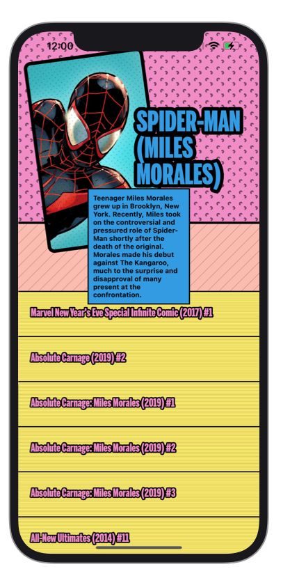

# Marvel App Assignment

**Hi Nick Fury!** As requested the iOS App that lists all the best possible Super Heroes. I hope this helps you save the universe. 🤞🤞🤞

 	
 	
 	

## API, Services and Caching

For this assignement I first focussed on creating a generic client side API to load data and images from the official Marvel API. On top of the API I build two services. The `Service` object is responsible for loading and parsing JSON data from the Marvel Characters endpoint and the `ImageService` is responsible for downloading images and storing them in the `ImageCache`. The `ImageCache` is not much more than a wrapper around `NSCache` and is the owner of the `ImageService` and repsonsible for fetching and returning images either from the cache or fresh from the internet.

## UX/UI Design

 	
 	
 	

For the visual style and overall look and feel of the app I tried to draw inspiration from data and images returned by the Marvel API and tried to create a matching comic-like style by choosing a very specific set of colors, using thick fonts and fat borders, adding quircky animations and cover everything in animating textures that wouldn't look out of place in a 1970's comic book.

## Loading Data and images

To populate the super heroes collection view, the view model utilizes a `UICollectionViewDiffableDataSource` to update snapshots of the data when new characters are loaded. When the user starts scrolling new data is loaded automagically and images are prefetched through the `UICollectionViewDataSourcePrefetching` protocol conformance. Making the loading of data and images (almost)completely transparent to the user.

 	

## Searching Characters

For the search we again depend heavily on our `UICollectionViewDiffableDataSource` to apply our filtered data in a new snapshot and animating the collection and layout to its new state. I created a custom `SearchAccessoryView` class that I pass as the `inputAccessoryView` of the view controller to make sure it's always on screen and animates with the showing and hiding of the keyboard.

 	

## Transitioning to Detail

To dive deeper into the details of one the characters of your choosing I created a quick and snappy custom view controller transition using UIKits `UIViewControllerAnimatedTransitioning` and related protocols. The idea was to give the suer the feeling you're really zooming in and out of a character.

 	

## What's next?

If I would have had more time I would have loved to spend it on the following subjects(in random order):

- improve overview to detail transition
- optimize image cache
- simplify and expand JSON models
- show more details of a character in their detail view
